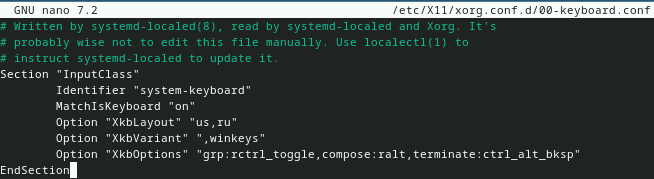

---
## Front matter
lang: ru-RU
title: Лабораторная работа №1
subtitle: Архитектура компьютера и операционные системы
author:
  - Кобзев Д. К.
institute:
  - Российский университет дружбы народов, Москва, Россия
date: 30 августа 2005

## i18n babel
babel-lang: russian
babel-otherlangs: english

## Formatting pdf
toc: false
toc-title: Содержание
slide_level: 2
aspectratio: 169
section-titles: true
theme: metropolis
header-includes:
 - \metroset{progressbar=frametitle,sectionpage=progressbar,numbering=fraction}
 - '\makeatletter'
 - '\beamer@ignorenonframefalse'
 - '\makeatother'

## Fonts
mainfont: PT Serif
romanfont: PT Serif
sansfont: PT Sans
monofont: PT Mono
mainfontoptions: Ligatures=TeX
romanfontoptions: Ligatures=TeX
sansfontoptions: Ligatures=TeX,Scale=MatchLowercase
monofontoptions: Scale=MatchLowercase,Scale=0.9
---

# Информация

## Докладчик

:::::::::::::: {.columns align=center}
::: {.column width="70%"}

  * Кобзев Дмитрий Константинович
  * студент
  * прикладная информатика
  * Российский университет дружбы народов
  * [1132231936@rudn.ru](mailto:1132231936@rudn.ru)

:::
::: {.column width="30%"}

:::
::::::::::::::

# Вводная часть

## Цель работы

Целью данной работы является приобретение практических навыков установки операционной системы на виртуальную машину, нЦелью данной работы
является приобретение практических навыков установки операционной системы на виртуальную машину, настройки минимально необходимых для дальнейшей работы сервисов.

## Домашнее задание

Получите следующую информацию.
Версия ядра Linux (Linux version).
Частота процессора (Detected Mhz processor).
Модель процессора (CPU0).
Объём доступной оперативной памяти (Memory available).
Тип обнаруженного гипервизора (Hypervisor detected).
Тип файловой системы корневого раздела.
Последовательность монтирования файловых систем.

# Выполнение лабораторной работы

## Установка системы на диск

Устанавливаем систему на диск

## Установка операционной системы

Устанавливаем операционную систему

## Роль супер-пользователя

Переключаемся на роль супер-пользователя

## Обновление всех пакетов`

Обновляем все пакеты

## Установка программы для удобства работы в консоли

Устанавливаем программы для удобства работы в консоли

## Установка программного обеспечения для автоматического обновления

Устанавливаем программное обеспечение для автоматического обновления

## Запуск таймера

Запускаем таймер

## Отключение SELinux

Отключаем SELinux, заменив значение в файле /etc/selinux/config

## Роль супер-пользователя

Запускаем терминальный мультиплескор tmux и переключаемся на роль супер-пользователя

## Установка средств разработки

Устанавливаем средства разработки

## Установка пакета DKMS

Устанавливаем пакет DKMS

## Подключение образа диска дополнений гостевой ОС

В меню виртуальной машины подключаем образ диска дополнений гостевой ОС

## Подмонтируем диск

Подмонтаж диска

## Устанавливаем драйвера

Установка драйверов

## Создание конфигурационного файла

Создаем конфигурационный файл ~/.config/sway/config.d/95-system-keyboard-config.conf 

## Редактирование конфигурационного файла

Отредактируем конфигурационный файл ~/.config/sway/config.d/95-system-keyboard-config.conf

## Редактирование конфигурационного файла

Отредактируем конфигурационный файл /etc/X11/xorg.conf.d/00-keyboard.conf

## Создание пользователя

Создаем пользователя, задаем пароль, устанавливаем имя хоста и проверяем, что имя хоста установлено верно

## Добавление своего пользователя в группу vboxsf

Внутри виртуальной машины добавляем своего пользователя в группу vboxsf

## Подключение разделяемой папки

В хостовой системе подключаем разделяемую папку

## Установка pandoc

Устанавливаем pandoc для работы с языком разметки Markdown

## Установка pandoc-crossref

Устанавливаем pandoc-crossref для работы с перекрестными ссылками и распаковываем в каталог /usr/local/bin

## Установка TexLive

Устанавливаем дистрибутив TexLive

# Домашнее задание

Используем команду dmesg

# Контрольные вопросы

1. Имя пользователя, название хоста.
2. man - для получения справки по команде.
cd - для перемещения по файловой системе.
ls - для просмотра содержимого каталога.
du - для определения объёма каталога.
mkdir/rm  - для создания / удаления каталогов / файлов.
chmod - для задания определённых прав на файл / каталог.
history - для просмотра истории команд.
3. Файловая система — это структура, используемая операционной системой>
4. С помощью команды findmnt.
5. С помощью команд kill и killall.
