---
## Front matter
lang: ru-RU
title: Лабораторная работа №2
subtitle: Архитектура компьютера и операционные системы
author:
  - Кобзев Д. К.
institute:
  - Российский университет дружбы народов, Москва, Россия
date: 30 августа 2005

## i18n babel
babel-lang: russian
babel-otherlangs: english

## Formatting pdf
toc: false
toc-title: Содержание
slide_level: 2
aspectratio: 169
section-titles: true
theme: metropolis
header-includes:
 - \metroset{progressbar=frametitle,sectionpage=progressbar,numbering=fraction}
 - '\makeatletter'
 - '\beamer@ignorenonframefalse'
 - '\makeatother'

## Fonts
mainfont: PT Serif
romanfont: PT Serif
sansfont: PT Sans
monofont: PT Mono
mainfontoptions: Ligatures=TeX
romanfontoptions: Ligatures=TeX
sansfontoptions: Ligatures=TeX,Scale=MatchLowercase
monofontoptions: Scale=MatchLowercase,Scale=0.9
---

# Информация

## Докладчик

:::::::::::::: {.columns align=center}
::: {.column width="70%"}

  * Кобзев Дмитрий Константинович
  * студент
  * прикладная информатика
  * Российский университет дружбы народов
  * [1132231936@rudn.ru](mailto:1132231936@rudn.ru)

:::
::: {.column width="30%"}

:::
::::::::::::::

# Вводная часть

## Цель работы

- Изучить идеологию и применение средств контроля версий.
- Освоить умения по работе с git. 

# Выполнение лабораторной работы

# Установка программного обеспечения

Устанавливаем git и gh
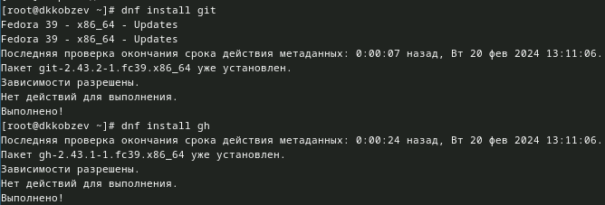

# Базовая настройка git

- Задаем имя и email владельца репозитория и настраиваем utf-8 в выводе сообщений git
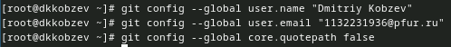
- Задаем имя начальной ветки, задаем параметры autocrlf и safecrlf 
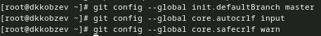

# Создание ключей ssh

- Создаем shh ключ по алгоритму rsa с ключем размером 4096 бит
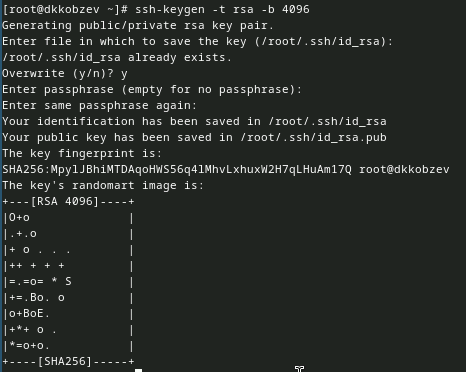

## Создание ключей ssh
 
- Создаем shh ключ по алгоритму ed25519 
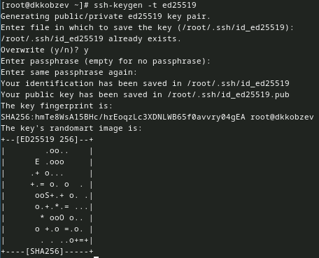

# Создание ключей pgp

Генерируем ключ
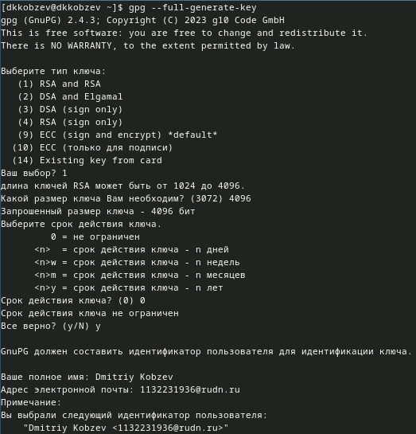

## Создание ключей pgp

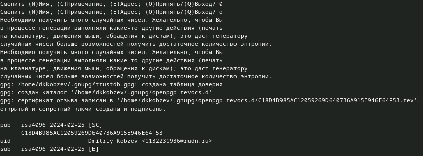

# Добавляем PGP ключ в GitHub

- Выводим список ключей и копируем отпечаток приватного ключа. Копируем наш сгенерированный PGP ключ в буфер обмена
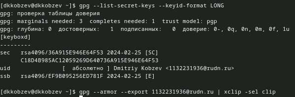

## Добавляем PGP ключ в GitHub

- Переходим в настройки GitHub, нажимаем на кнопку New PGP key и вставляем полученный ключ в поле ввода
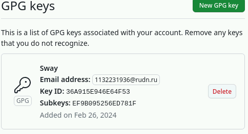

# Настройка автоматических подписей коммитов git

Используя введеный email, указываем Git применять его при подписи коммитов
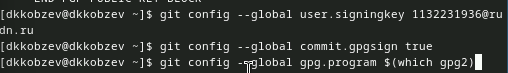

# Настройка gh

Авторизовываемся через gh
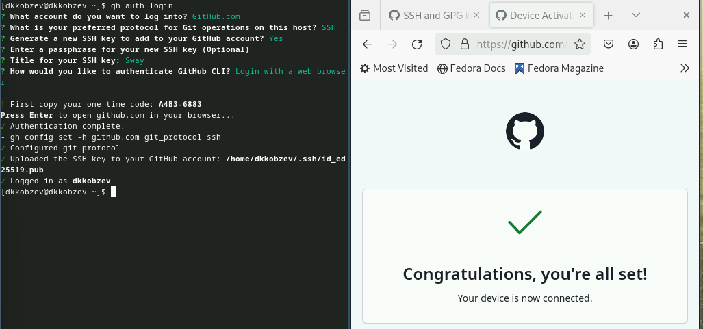

# Шаблон для рабочего пространства

## Создание репозитория курса на основе шаблона

Создаем репозиторий курса на основе шаблона
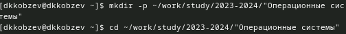
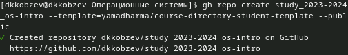
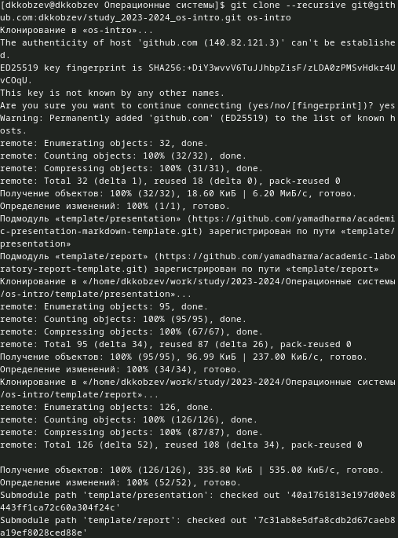

## Настройка каталога курса

- Переходим в каталог курса,удаляем лишние файлы и создаем необходимые каталоги
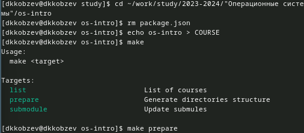

## Настройка каталога курса

- Отправляем файлы на сервер
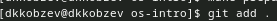
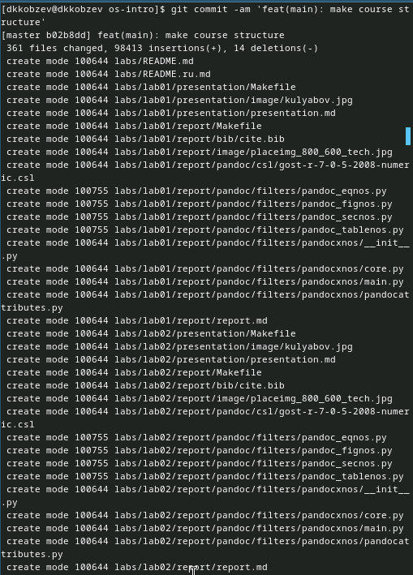

## Настройка каталога курса

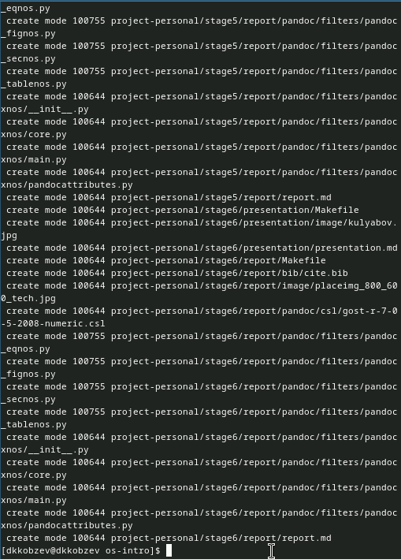

## Настройка каталога курса

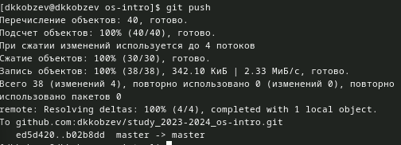

# Контрольные вопросы

1. Системы контроля версий (VCS) предназначены для управления изменениями в исходном коде и других файлов проекта, позволяя отслеживать изменения, управлять версиями, совместно	работать, создавать резервные копии, отслеживать авторство, управлять конфликтами, а также эксперементировать  и ветвить проекты.
2. Хранилище - место, где хранятся файлы проекта и история их изменений.
Commit - сохранение текущего состояния файлов проекта с описанием изменений.
История - записи о всех сделанных изменениях в проекте.
Рабочая копия - локальная копия файлов проекта, позволяющая вносить изменения и синхронизироват их с хранилищем.

## Контрольные вопросы

3. Централизованные VCS: В таких системах основной репозиторий находится на центральном сервере. Разработчики обычно работают с локальными копиями файлов, синхронизируя их с центральным сервером при необходимости. Все действия происходят через этот центральный репозиторий.
Примеры централизованных VCS:
Subversion (SVN)
CVS (Concurrent Versions System)
Децентрализованные VCS: В децентрализованных системах каждый разработчик имеет локальную копию полного репозитория, включая всю его историю и метаданные. Это означает, что разработчики могут работать независимо друг от друга и без постоянного подключения к центральному серверу. Синхронизация изменений происходит напрямую между локальными репозиториями.
Примеры децентрализованных VCS:
Git
Mercurial

## Контрольные вопросы

4. Создание репозитория, добавление файлов для работы, фиксация изменений, отправка файлов на сервер.
5. Клонирование репозитория, работа с файлами, добавление файлов, фиксация изменений, получение изменений, отправка изменений на сервер.

## Контрольные вопросы

6. Управление версиями файлов проекта.
Совместная разработка между несколькими разработчиками.
Отслеживание изменений и истории проекта.
Ветвление и слияние изменений для разработки новых функций.
Резервное копирование и восстановление данных.
Работа с удаленными репозиториями для совместной работы и обмена изменениями.

## Контрольные вопросы

7. Команда git add добавляет содержимое рабочего каталога в индекс для последующего коммита.
Команда git commit берёт все данные, добавленные в индекс с помощью git add, и сохраняет их.
Команда git clone клонирует существующий репозиторий Git, создавая локальную копию.
Команда git init cоздает новый репозиторий Git в текущем каталоге.
Команда git status показывает состояния файлов в рабочем каталоге и индексе.
Команда git push отправляет локальные коммиты в удаленный репозиторий.
Команда git pull получает изменения из удаленного репозитория и объединяет их с локальными изменениями.
Команда git diff используется для вычисления разницы между любыми двумя Git деревьями.
Команда git branch gоказывает список веток, а также создает, удаляет или переключается между ними.

## Контрольные вопросы

8. Локальный: git commit - фиксирует изменения
Удаленный: git push - отправляет изменения на сервер
9. Ветви (branches) в системах контроля версий, представляют собой механизм, позволяющий разработчикам работать параллельно над разными версиями>

## Контрольные вопросы

10. Игнорировать файлы при commit можно с помощью файла '.gitignore'. Этот файл содержит шаблоны путей к файлам и каталогам, которые не должны быть добавлены в репозиторий Git.
Как использовать:
Создаем файл '.gitignore' в корневом каталоге проекта и добавляем в него шаблоны путей к файлам и каталогам, которые хотим проигнорировать. Добавляем файл в репозиторий Git и выполняем коммит.
Зачем:
Игнорировать временные файлы, не являющиеся частью исходного кода.
Предотвращение попадания конфеденциальных данных в репозиторий.
Улучшение производительности Git, исключив большие или ненужные файлы из репозитория.
