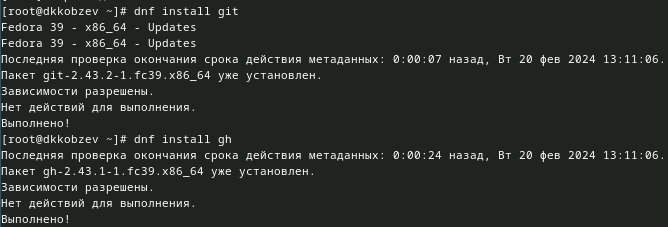
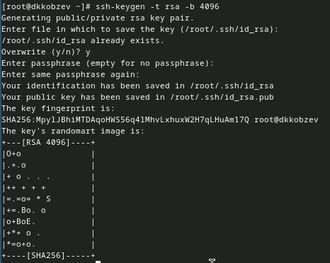
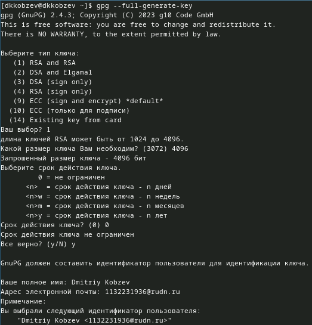
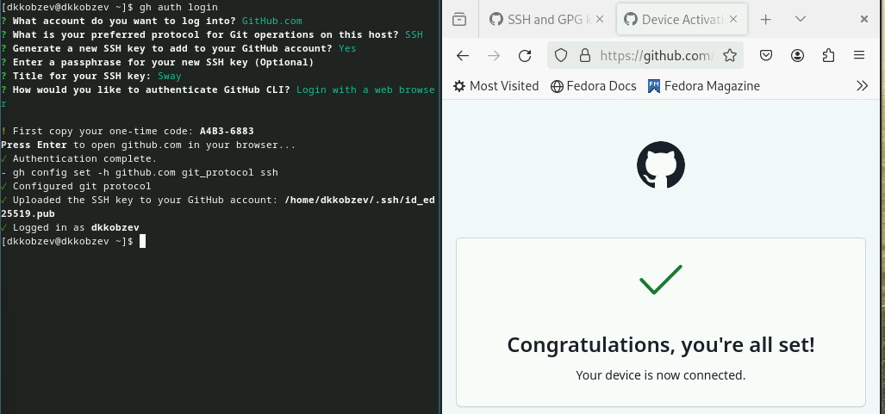
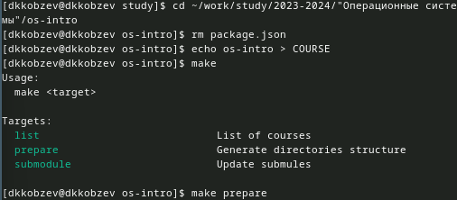
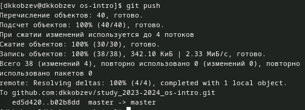

---
## Front matter
title: "Отчет по лабораторной работе №2"
subtitle: "Архитектура компьютеров и операционные системы"
author: "Дмитрий Константинович Кобзев"

## Generic otions
lang: ru-RU
toc-title: "Содержание"

## Bibliography
bibliography: bib/cite.bib
csl: pandoc/csl/gost-r-7-0-5-2008-numeric.csl

## Pdf output format
toc: true # Table of contents
toc-depth: 2
lof: true # List of figures
lot: true # List of tables
fontsize: 12pt
linestretch: 1.5
papersize: a4
documentclass: scrreprt
## I18n polyglossia
polyglossia-lang:
  name: russian
  options:
	- spelling=modern
	- babelshorthands=true
polyglossia-otherlangs:
  name: english
## I18n babel
babel-lang: russian
babel-otherlangs: english
## Fonts
mainfont: PT Serif
romanfont: PT Serif
sansfont: PT Sans
monofont: PT Mono
mainfontoptions: Ligatures=TeX
romanfontoptions: Ligatures=TeX
sansfontoptions: Ligatures=TeX,Scale=MatchLowercase
monofontoptions: Scale=MatchLowercase,Scale=0.9
## Biblatex
biblatex: true
biblio-style: "gost-numeric"
biblatexoptions:
  - parentracker=true
  - backend=biber
  - hyperref=auto
  - language=auto
  - autolang=other*
  - citestyle=gost-numeric
## Pandoc-crossref LaTeX customization
figureTitle: "Рис."
tableTitle: "Таблица"
listingTitle: "Листинг"
lofTitle: "Список иллюстраций"
lotTitle: "Список таблиц"
lolTitle: "Листинги"
## Misc options
indent: true
header-includes:
  - \usepackage{indentfirst}
  - \usepackage{float} # keep figures where there are in the text
  - \floatplacement{figure}{H} # keep figures where there are in the text
---

# Цель работы

Изучить идеологию и применение средств контроля версий.  
Освоить умения по работе с git.  

# Задание

Создать базовую конфигурацию для работы с git.  
Создать ключ SSH.  
Создать ключ PGP.  
Настроить подписи git.  
Зарегистрироваться на Github.  
Создать локальный каталог для выполнения заданий по предмету.  

# Теоретическое введение

Здесь описываются теоретические аспекты, связанные с выполнением работы.

Например, в табл. [-@tbl:std-dir] приведено краткое описание стандартных каталогов Unix.

: Описание некоторых каталогов файловой системы GNU Linux {#tbl:std-dir}

| Имя каталога | Описание каталога                                                                                                          |
|--------------|----------------------------------------------------------------------------------------------------------------------------|
| `/`          | Корневая директория, содержащая всю файловую                                                                               |
| `/bin `      | Основные системные утилиты, необходимые как в однопользовательском режиме, так и при обычной работе всем пользователям     |
| `/etc`       | Общесистемные конфигурационные файлы и файлы конфигурации установленных программ                                           |
| `/home`      | Содержит домашние директории пользователей, которые, в свою очередь, содержат персональные настройки и данные пользователя |
| `/media`     | Точки монтирования для сменных носителей                                                                                   |
| `/root`      | Домашняя директория пользователя  `root`                                                                                   |
| `/tmp`       | Временные файлы                                                                                                            |
| `/usr`       | Вторичная иерархия для данных пользователя                                                                                 |

Более подробно про Unix см. в [@tanenbaum_book_modern-os_ru; @robbins_book_bash_en; @zarrelli_book_mastering-bash_en; @newham_book_learning-bash_en].

# Выполнение лабораторной работы

Устанавливаем git и gh (рис. [-@fig:001]).

{#fig:001 width=70%}

Задаем имя и email владельца репозитория и настраиваем utf-8 в выводе сообщений git (рис. [-@fig:002])

{#fig:002 width=70%}

Задаем имя начальной ветки, задаем параметры autocrlf и safecrlf (рис. [-@fig:003]).

{#fig:003 width=70%}

Создаем shh ключ по алгоритму rsa с ключем размером 4096 бит (рис. [-@fig:004])

{#fig:004 width=70%}

Создаем shh ключ по алгоритму ed25519 (рис. [-@fig:005])

{#fig:005 width=70%}

Генерируем ключ pgp (рис. [-@fig:006]).

{#fig:006 width=70%}
{#fig:007 width=70%}

Выводим список ключей и копируем отпечаток приватного ключа. Копируем наш сгенерированный PGP ключ в буфер обмена (рис. [-@fig:008]).

{#fig:008 width=70%}

Переходим в настройки GitHub, нажимаем на кнопку New PGP key и вставляем полученный ключ в поле ввода (рис. [-@fig:009]).

{#fig:009 width=70%}

Используя введеный email, указываем Git применять его при подписи коммитов (рис. [-@fig:010]).

{#fig:010 width=70%}

Авторизовываемся через gh (рис. [-@fig:011]).

{#fig:011 width=70%}

Создаем репозиторий курса на основе шаблона (рис. [-@fig:012]), (рис. [-@fig:013]), (рис. [-@fig:014]).

{#fig:012 width=70%}
{#fig:013 width=70%}
{#fig:014 width=70%}

Переходим в каталог курса,удаляем лишние файлы и создаем необходимые каталоги (рис. [-@fig:015]).

{#fig:015 width=70%}

Отправляем файлы на сервер (рис. [-@fig:016]), (рис. [-@fig:017]), (рис. [-@fig:018]), (рис. [-@fig:019]).

{#fig:016 width=70%}
{#fig:017 width=70%}
{#fig:018 width=70%}
{#fig:019 width=70%}

# Контрольные вопросы

1. Системы контроля версий (VCS) предназначены для управления изменениями в исходном коде и других файлов проекта, позволяя отслеживать изменения, управлять версиями, совместно работать, создавать резервные копии, отслеживать авторство, управлять конфликтами, а также экспериментировать и ветвить проекты.
2. Хранилище - место, где хранятся файлы проекта и история их изменений.
Commit - сохранение текущего состояния файлов проекта с описанием изменений.
История - записи о всех сделанных изменениях в проекте.
Рабочая копия - локальная копия файлов проекта, позволяющая вносить изменения и синхронизироват их с хранилищем.
3. Централизованные VCS: В таких системах основной репозиторий находится на центральном сервере. Разработчики обычно работают с локальными копиями файлов, синхронизируя их с центральным сервером при необходимости. Все действия происходят через этот центральный репозиторий.
Примеры централизованных VCS:
Subversion (SVN)
CVS (Concurrent Versions System)
Децентрализованные VCS: В децентрализованных системах каждый разработчик имеет локальную копию полного репозитория, включая всю его историю и метаданные. Это означает, что разработчики могут работать независимо друг от друга и без постоянного подключения к центральному серверу. Синхронизация изменений происходит напрямую между локальными репозиториями.
Примеры децентрализованных VCS:
Git
Mercurial
4. Создание репозитория, добавление файлов для работы, фиксация изменений, отправка файлов на сервер.
5. Клонирование репозитория, работа с файлами, добавление файлов, фиксация изменений, получение изменений, отправка изменений на сервер.
6. Управление версиями файлов проекта.
Совместная разработка между несколькими разработчиками.
Отслеживание изменений и истории проекта.
Ветвление и слияние изменений для разработки новых функций.
Резервное копирование и восстановление данных.
Работа с удаленными репозиториями для совместной работы и обмена изменениями.
7. Команда git add добавляет содержимое рабочего каталога в индекс для последующего коммита.
Команда git commit берёт все данные, добавленные в индекс с помощью git add, и сохраняет их.
Команда git clone клонирует существующий репозиторий Git, создавая локальную копию.
Команда git init cоздает новый репозиторий Git в текущем каталоге.
Команда git status показывает состояния файлов в рабочем каталоге и индексе.
Команда git push отправляет локальные коммиты в удаленный репозиторий.
Команда git pull получает изменения из удаленного репозитория и объединяет их с локальными изменениями.
Команда git diff используется для вычисления разницы между любыми двумя Git деревьями.
Команда git branch gоказывает список веток, а также создает, удаляет или переключается между ними.
8. Локальный: git commit - фиксирует изменения
Удаленный: git push - отправляет изменения на сервер
9. Ветви (branches) в системах контроля версий, представляют собой механизм, позволяющий разработчикам работать параллельно над разными версиями проекта, изолируя изменения и эксперименты от основной линии разработки.  
10. Игнорировать файлы при commit можно с помощью файла '.gitignore'. Этот файл содержит шаблоны путей к файлам и каталогам, которые не должны быть добавлены в репозиторий Git. 
Как использовать:
Создаем файл '.gitignore' в корневом каталоге проекта и добавляем в него шаблоны путей к файлам и каталогам, которые хотим проигнорировать. Добавляем файл в репозиторий Git и выполняем коммит.
Зачем:
Игнорировать временные файлы, не являющиеся частью исходного кода.
Предотвращение попадания конфеденциальных данных в репозиторий.
Улучшение производительности Git, исключив большие или ненужные файлы из репозитория.

# Выводы

Мною были изучены идеология и применение средств контроля версий иосвоены умения по работе с git.

# Список литературы{.unnumbered}

::: {#refs}
:::
