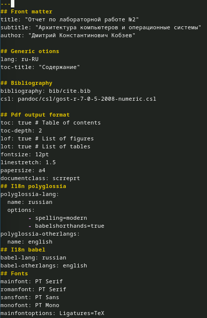
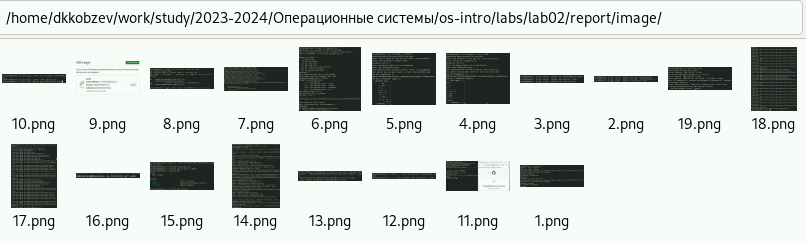
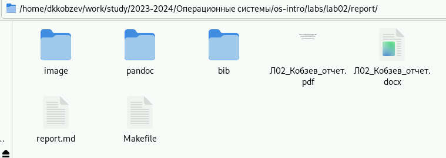
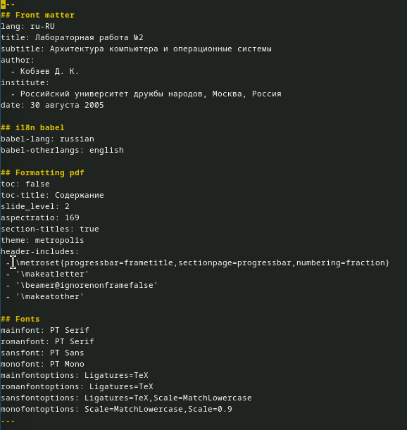
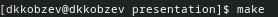
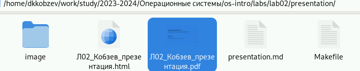

---
## Front matter
lang: ru-RU
title: Лабораторная работа №3
subtitle: Архитектура компьютера и операционные системы
author:
  - Кобзев Д. К.
institute:
  - Российский университет дружбы народов, Москва, Россия
date: 30 августа 2005

## i18n babel
babel-lang: russian
babel-otherlangs: english

## Formatting pdf
toc: false
toc-title: Содержание
slide_level: 2
aspectratio: 169
section-titles: true
theme: metropolis
header-includes:
 - \metroset{progressbar=frametitle,sectionpage=progressbar,numbering=fraction}
 - '\makeatletter'
 - '\beamer@ignorenonframefalse'
 - '\makeatother'

## Fonts
mainfont: PT Serif
romanfont: PT Serif
sansfont: PT Sans
monofont: PT Mono
mainfontoptions: Ligatures=TeX
romanfontoptions: Ligatures=TeX
sansfontoptions: Ligatures=TeX,Scale=MatchLowercase
monofontoptions: Scale=MatchLowercase,Scale=0.9
---

# Информация

## Докладчик

:::::::::::::: {.columns align=center}
::: {.column width="70%"}

  * Кобзев Дмитрий Константинович
  * студент
  * прикладная информатика
  * Российский университет дружбы народов
  * [1132231936@rudn.ru](mailto:1132231936@rudn.ru)

:::
::: {.column width="30%"}

:::
::::::::::::::

# Вводная часть

## Цель работы

Научиться оформлять отчеты с помощью легковесного языка разметки Markdown.

# Выполнение лабораторной работы

## Заполнение отчета

Заполняем отчет лабораторной работы №2 в report.md

## Загрузка скриншотов

Загружаем скриншоты в папку image 

## Компиляция отчетов

Компилируем отчеты в pdf и docx 

## Готовые отчеты

Переименовываем отчеты

## Создание презентации

Заполняем презентацию

## Компиляция презентации

Компилируем презентации в html и pdf 

## Готовые презентации

Переименовываем презентации

