---
## Front matter
lang: ru-RU
title: Лабораторная работа №4
subtitle: Архитектура компьютера и операционные системы
author:
  - Кобзев Д. К.
institute:
  - Российский университет дружбы народов, Москва, Россия
date: 30 августа 2005

## i18n babel
babel-lang: russian
babel-otherlangs: english

## Formatting pdf
toc: false
toc-title: Содержание
slide_level: 2
aspectratio: 169
section-titles: true
theme: metropolis
header-includes:
 - \metroset{progressbar=frametitle,sectionpage=progressbar,numbering=fraction}
 - '\makeatletter'
 - '\beamer@ignorenonframefalse'
 - '\makeatother'

## Fonts
mainfont: PT Serif
romanfont: PT Serif
sansfont: PT Sans
monofont: PT Mono
mainfontoptions: Ligatures=TeX
romanfontoptions: Ligatures=TeX
sansfontoptions: Ligatures=TeX,Scale=MatchLowercase
monofontoptions: Scale=MatchLowercase,Scale=0.9
---

# Информация

## Докладчик

:::::::::::::: {.columns align=center}
::: {.column width="70%"}

  * Кобзев Дмитрий Константинович
  * студент
  * прикладная информатика
  * Российский университет дружбы народов
  * [1132231936@rudn.ru](mailto:1132231936@rudn.ru)

:::
::: {.column width="30%"}

:::
::::::::::::::

# Вводная часть

## Цель работы

Получение навыков правильной работы с репозиториями git.

# Выполнение лабораторной работы

# Установка git-flow

- Устанавливаем git-flow
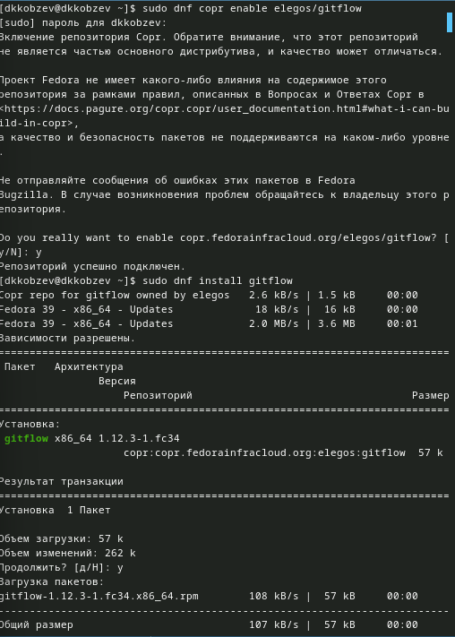

# Устанавка Node.js

- Устанавливаем Node.js
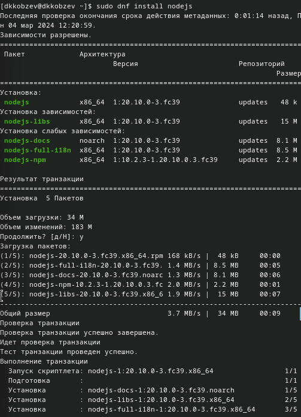

# Установка Node.js

- Устанавливаем apt
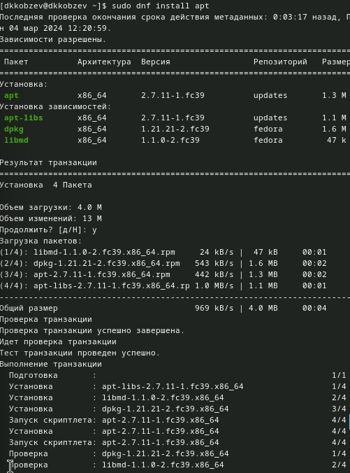

# Выполение source ~/.bashrc

- Выполеняем source ~/.bashrc]
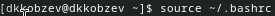

# Настройка общепринятых коммитов

- Настраиваем общепринятые коммиты
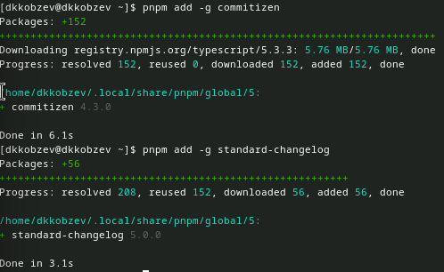

# Создание репозитория

- Создаем репозиторий git и клонируем его
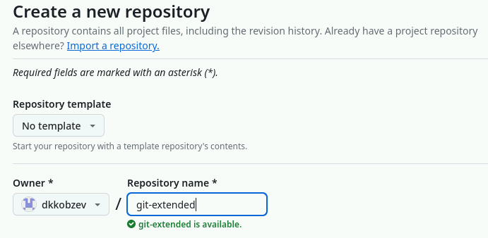

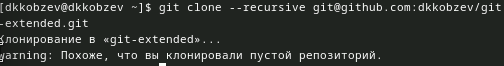

# Первый коммит

- Делаем первый коммит и выкладываем на github 

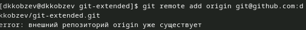

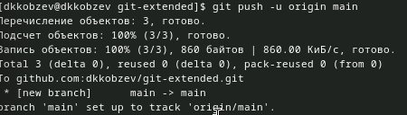

# Конфигурация для пакетов Node.js

- Конфигурируем общепринятые коммиты 
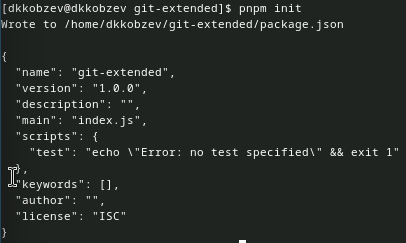

# Параметры пакета

- Заполняем параметры пакета 
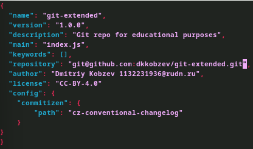

# Добавление новых файлов

- Добавляем новые файлы
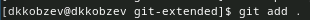

# Выполнение коммита и отправка файлов на github 

- Выполняем коммит и отправляем на github 
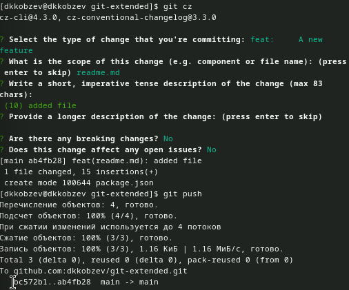

# Инициализация git-flow

- Инициализируем git-flow
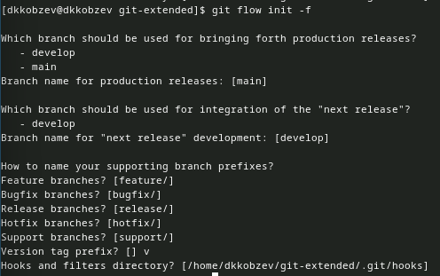

# Команды git branch и git push

- Проверяем, что мы на ветке develop и загружаем весь репозиторий в хранилище
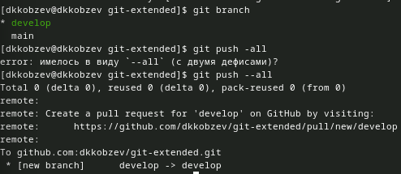

# Команды git branch и git flow

- Устанавливаем внешнюю ветку как вышестоящую для этой ветки и создаем релиз в версией 1.0.0
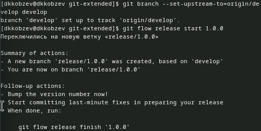

# Создание журнала изменений, команды git add, git commit и git flow

- Создаем журнал изменений, добавляем журнал изменений в индекс и заливаем релизную ветку в основную ветку 
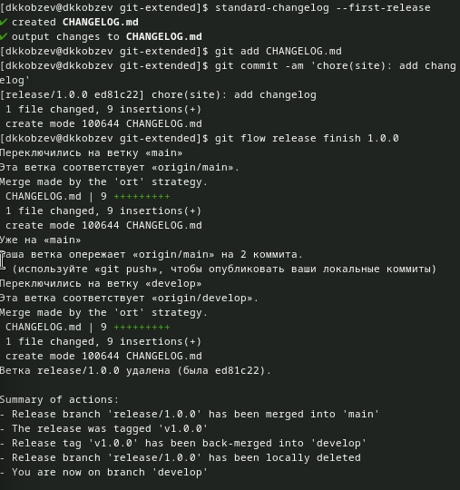

# Отправка файлов на github и создание релиза

- Отправляем данные на github и создаем релиз 
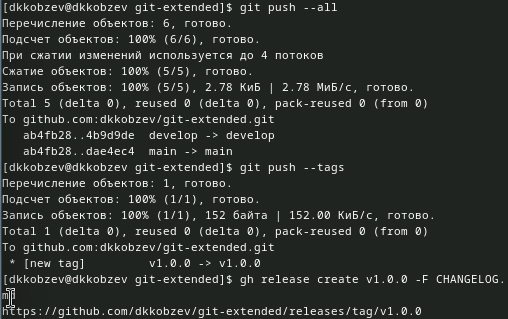

# Команда git flow

- Создаем ветку для новой функциональности и объединяем ветку feature_branch с develop 
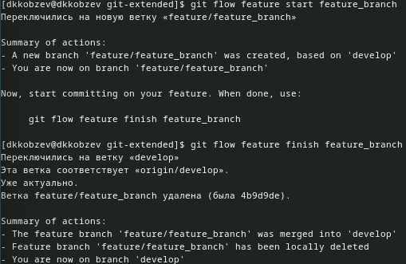

# Файл package.json

- Создаем релиз в версией 1.2.3 и обновляем номер версии в файле package.json 
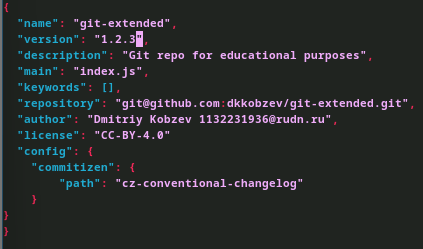

# Создание журнала изменений, команды git add, git commit и git flow

- Создаем журнал изменений, добавляем журнал изменений в индекс и заливаем релизную ветку в основную ветку
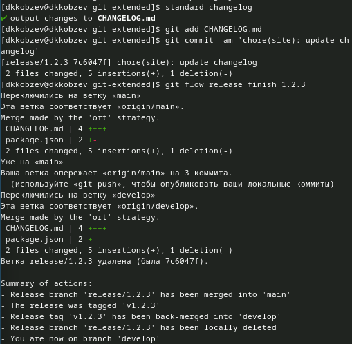

# Отправка файлов на github

Отправляем данные на github
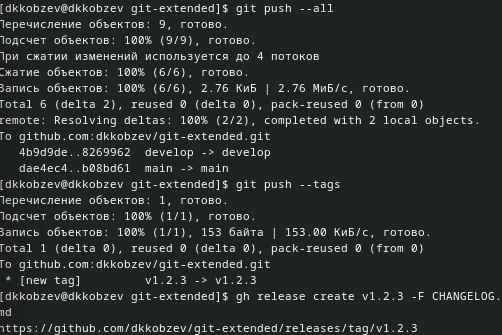
