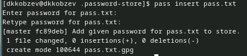

---
## Front matter
lang: ru-RU
title: Лабораторная работа №5
subtitle: Архитектура компьютера и операционные системы
author:
  - Кобзев Д. К.
institute:
  - Российский университет дружбы народов, Москва, Россия
date: 30 августа 2005

## i18n babel
babel-lang: russian
babel-otherlangs: english

## Formatting pdf
toc: false
toc-title: Содержание
slide_level: 2
aspectratio: 169
section-titles: true
theme: metropolis
header-includes:
 - \metroset{progressbar=frametitle,sectionpage=progressbar,numbering=fraction}
 - '\makeatletter'
 - '\beamer@ignorenonframefalse'
 - '\makeatother'

## Fonts
mainfont: PT Serif
romanfont: PT Serif
sansfont: PT Sans
monofont: PT Mono
mainfontoptions: Ligatures=TeX
romanfontoptions: Ligatures=TeX
sansfontoptions: Ligatures=TeX,Scale=MatchLowercase
monofontoptions: Scale=MatchLowercase,Scale=0.9
---

# Информация

## Докладчик

:::::::::::::: {.columns align=center}
::: {.column width="70%"}

  * Кобзев Дмитрий Константинович
  * студент
  * прикладная информатика
  * Российский университет дружбы народов
  * [1132231936@rudn.ru](mailto:1132231936@rudn.ru)

:::
::: {.column width="30%"}

:::
::::::::::::::

# Менеджер паролей pass

## Установка

- Устанавливаем менеджер паролей pass

## Установка

- Устанавливаем менеджер паролей pass

## Настройка 

- Просматриваем список ключей и инициализируем хранилище 

## Настройка 

- Создаем репозиторий

## Настройка 

- Создаем структуру git и задаем адрес репозитория на хостинге

## Настройка 

- Синхронизируем

## Настройка 

- Коммитим и выкладываем изменениия

## Настройка 

- Проверяем статус синхронизации

## Настройка интерфейса с броузером

- Устанавливаем browserpass

## Настройка интерфейса с броузером

- Устанавливаем browserpass

## Настройка интерфейса с броузером

- Устанавливаем browserpass

## Настройка интерфейса с броузером

- Добавляем новый пароль

## Настройка интерфейса с броузером

- Отображаем пароль

## Настройка интерфейса с броузером

- Меняем существующий пароль

# Управление файлами конфигурации и дополнительное программное обеспечение

- Устанавливаем дополнительное ПО 

## Управление файлами конфигурации и дополнительное программное обеспечение

- Устанавливаем шрифты

## Управление файлами конфигурации и дополнительное программное обеспечение

- Устанавливаем шрифты

## Управление файлами конфигурации и дополнительное программное обеспечение

- Устанавливаем шрифты

## Установка 

- Устанавливаем бинарный файл

## Создание собственного репозитория с помощью утилит

- Создаем свой репозиторий для конфигурационных файлов на основе шаблона

## Подключение репозитория к своей системе

- Инициализируем chezmoi с нашим репозиторией dotfiles, проверяем, какие изменения внесет chezmoi в домашний каталог и подтверждаем изменения

## Использование chezmoi на нескольких машинах

- На второй машине инициализируем chezmoi с нашим репозиторией dotfiles, проверяем, какие изменения внесет chezmoi в домашний каталог и подтверждаем изменения 

## Использование chezmoi на нескольких машинах и настройка новой машины с помощью одной команды

- Получаем и применяем последние изменения из нашего репозитория и устанавливаем свои dotfiles на новый компьютер

## Ежедневный операции с chezmoi

- Извлекаем изменения из репозитория и применяем их одной командой и извлекаем последние изменения из своего репозитория и смотрим, что изменится

## Ежедневный операции с chezmoi

- Редактируем файл конфигурации ~/.config/chezmoi/chezmoi.toml

