---
## Front matter
title: "Отчет по лабораторной работе №5"
subtitle: "Архитектура компьютеров и операционные системы"
author: "Дмитрий Константинович Кобзев"

## Generic otions
lang: ru-RU
toc-title: "Содержание"

## Bibliography
bibliography: bib/cite.bib
csl: pandoc/csl/gost-r-7-0-5-2008-numeric.csl

## Pdf output format
toc: true # Table of contents
toc-depth: 2
lof: true # List of figures
lot: true # List of tables
fontsize: 12pt
linestretch: 1.5
papersize: a4
documentclass: scrreprt
## I18n polyglossia
polyglossia-lang:
  name: russian
  options:
	- spelling=modern
	- babelshorthands=true
polyglossia-otherlangs:
  name: english
## I18n babel
babel-lang: russian
babel-otherlangs: english
## Fonts
mainfont: PT Serif
romanfont: PT Serif
sansfont: PT Sans
monofont: PT Mono
mainfontoptions: Ligatures=TeX
romanfontoptions: Ligatures=TeX
sansfontoptions: Ligatures=TeX,Scale=MatchLowercase
monofontoptions: Scale=MatchLowercase,Scale=0.9
## Biblatex
biblatex: true
biblio-style: "gost-numeric"
biblatexoptions:
  - parentracker=true
  - backend=biber
  - hyperref=auto
  - language=auto
  - autolang=other*
  - citestyle=gost-numeric
## Pandoc-crossref LaTeX customization
figureTitle: "Рис."
tableTitle: "Таблица"
listingTitle: "Листинг"
lofTitle: "Список иллюстраций"
lotTitle: "Список таблиц"
lolTitle: "Листинги"
## Misc options
indent: true
header-includes:
  - \usepackage{indentfirst}
  - \usepackage{float} # keep figures where there are in the text
  - \floatplacement{figure}{H} # keep figures where there are in the text
---

# Теоретическое введение

Здесь описываются теоретические аспекты, связанные с выполнением работы.

Например, в табл. [-@tbl:std-dir] приведено краткое описание стандартных каталогов Unix.

: Описание некоторых каталогов файловой системы GNU Linux {#tbl:std-dir}

| Имя каталога | Описание каталога                                                                                                          |
|--------------|----------------------------------------------------------------------------------------------------------------------------|
| `/`          | Корневая директория, содержащая всю файловую                                                                               |
| `/bin `      | Основные системные утилиты, необходимые как в однопользовательском режиме, так и при обычной работе всем пользователям     |
| `/etc`       | Общесистемные конфигурационные файлы и файлы конфигурации установленных программ                                           |
| `/home`      | Содержит домашние директории пользователей, которые, в свою очередь, содержат персональные настройки и данные пользователя |
| `/media`     | Точки монтирования для сменных носителей                                                                                   |
| `/root`      | Домашняя директория пользователя  `root`                                                                                   |
| `/tmp`       | Временные файлы                                                                                                            |
| `/usr`       | Вторичная иерархия для данных пользователя                                                                                 |

Более подробно про Unix см. в [@tanenbaum_book_modern-os_ru; @robbins_book_bash_en; @zarrelli_book_mastering-bash_en; @newham_book_learning-bash_en].

# Выполнение лабораторной работы        

Устанавливаем менеджер паролей pass (рис. [-@fig:001]), (рис. [-@fig:002])
 
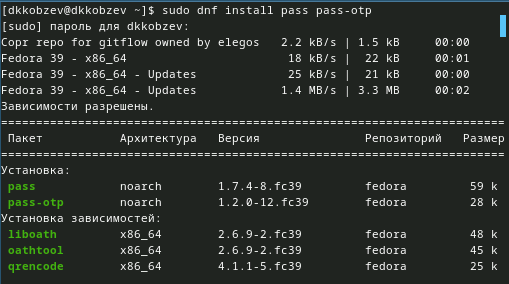{#fig:001 width=70%}

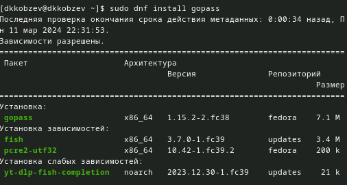{#fig:002 width=70%}

Просматриваем список ключей и инициализируем хранилище (рис. [-@fig:003])
 
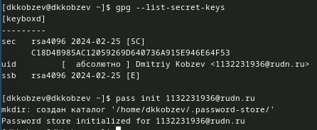{#fig:003 width=70%}

Создаем репозиторий (рис. [-@fig:004])
 
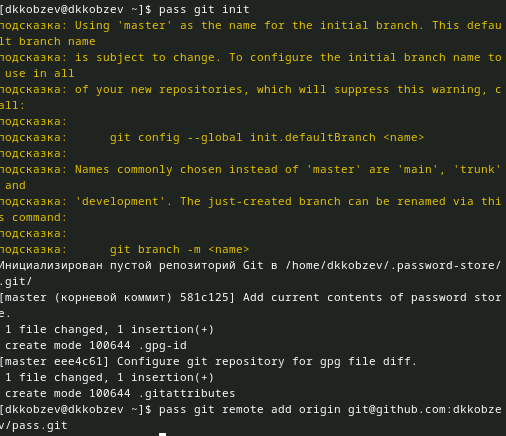{#fig:004 width=70%}

Создаем структуру git и задаем адрес репозитория на хостинге (рис. [-@fig:005])
 
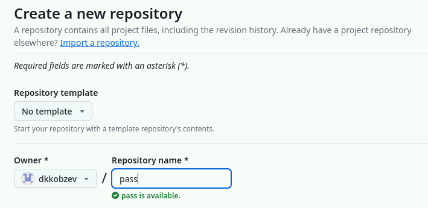{#fig:005 width=70%}

Синхронизируем (рис. [-@fig:006])
 
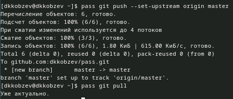{#fig:006 width=70%}

Коммитим и выкладываем изменениия (рис. [-@fig:007])
 
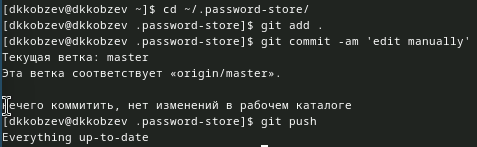{#fig:007 width=70%}

Проверяем статус синхронизации (рис. [-@fig:008])
 
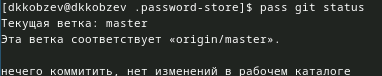{#fig:008 width=70%}

Устанавливаем browserpass (рис. [-@fig:009]), (рис. [-@fig:010]), (рис. [-@fig:011])
 
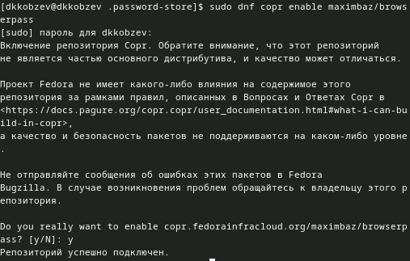{#fig:009 width=70%}

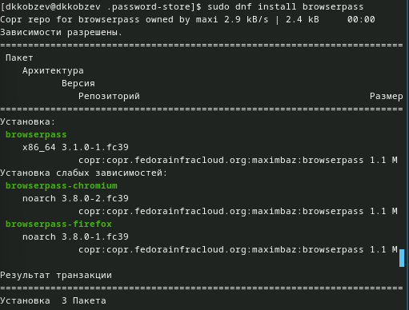{#fig:010 width=70%}
 
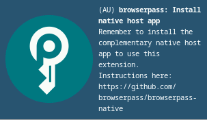{#fig:011 width=70%}

Добавляем новый пароль (рис. [-@fig:012])
 
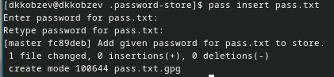{#fig:012 width=70%}

Отображаем пароль (рис. [-@fig:013])
 
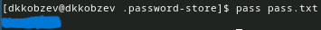{#fig:013 width=70%}

Меняем существующий пароль (рис. [-@fig:014])
 
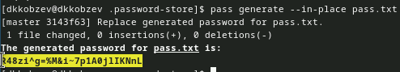{#fig:014 width=70%}

Устанавливаем дополнительное ПО (рис. [-@fig:015])
 
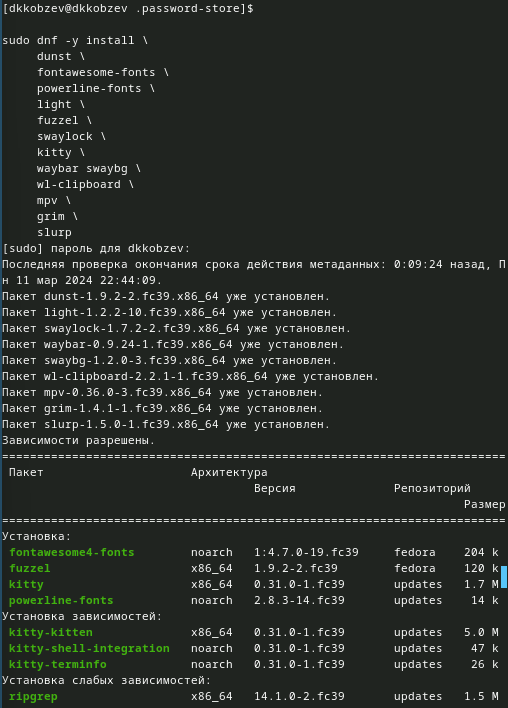{#fig:015 width=70%}

Устанавливаем шрифты (рис. [-@fig:016]), (рис. [-@fig:017]),  (рис. [-@fig:018])
 
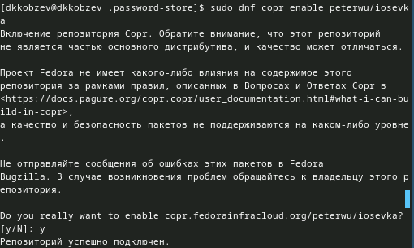{#fig:016 width=70%}

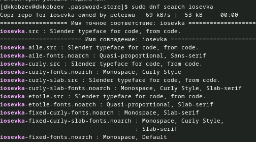{#fig:017 width=70%}

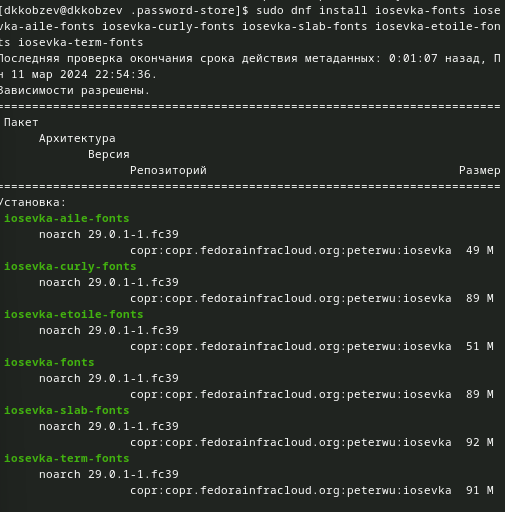{#fig:018 width=70%}

Устанавливаем бинарный файл (рис. [-@fig:019])
 
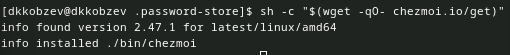{#fig:019 width=70%}

Создаем свой репозиторий для конфигурационных файлов на основе шаблона (рис. [-@fig:020])
 
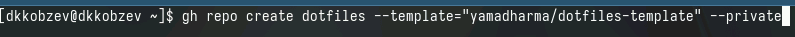{#fig:020 width=70%}

Инициализируем chezmoi с нашим репозиторией dotfiles, проверяем, какие изменения внесет chezmoi в домашний каталог и подтверждаем изменения (рис. [-@fig:021])
 
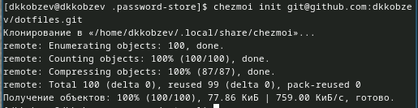{#fig:021 width=70%}

На второй машине инициализируем chezmoi с нашим репозиторией dotfiles, проверяем, какие изменения внесет chezmoi в домашний каталог и подтверждаем изменения (рис. [-@fig:022])
 
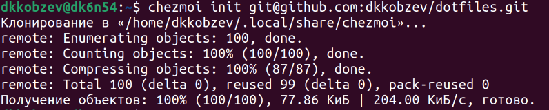{#fig:022 width=70%}

Получаем и применяем последние изменения из нашего репозитория и устанавливаем свои dotfiles на новый компьютер (рис. [-@fig:023])
 
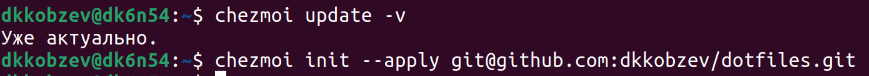{#fig:023 width=70%}

Извлекаем изменения из репозитория и применяем их одной командой и извлекаем последние изменения из своего репозитория и смотрим, что изменится (рис. [-@fig:024])
 
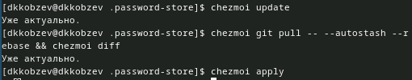{#fig:024 width=70%}

Редактируем файл конфигурации ~/.config/chezmoi/chezmoi.toml (рис. [-@fig:025])
 
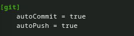{#fig:025 width=70%}
