---
## Front matter
lang: ru-RU
title: Лабораторная работа №6
subtitle: Архитектура компьютера и операционные системы
author:
  - Кобзев Д. К.
institute:
  - Российский университет дружбы народов, Москва, Россия
date: 30 августа 2005

## i18n babel
babel-lang: russian
babel-otherlangs: english

## Formatting pdf
toc: false
toc-title: Содержание
slide_level: 2
aspectratio: 169
section-titles: true
theme: metropolis
header-includes:
 - \metroset{progressbar=frametitle,sectionpage=progressbar,numbering=fraction}
 - '\makeatletter'
 - '\beamer@ignorenonframefalse'
 - '\makeatother'

## Fonts
mainfont: PT Serif
romanfont: PT Serif
sansfont: PT Sans
monofont: PT Mono
mainfontoptions: Ligatures=TeX
romanfontoptions: Ligatures=TeX
sansfontoptions: Ligatures=TeX,Scale=MatchLowercase
monofontoptions: Scale=MatchLowercase,Scale=0.9
---

# Информация

## Докладчик

:::::::::::::: {.columns align=center}
::: {.column width="70%"}

  * Кобзев Дмитрий Константинович
  * студент
  * прикладная информатика
  * Российский университет дружбы народов
  * [1132231936@rudn.ru](mailto:1132231936@rudn.ru)

:::
::: {.column width="30%"}

:::
::::::::::::::

# Выполнение лабораторной работы

## Полное имя домашнего каталога

- Определяем полное имя нашего домашнего каталога

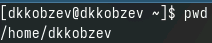

## Переход в каталог /tmp

- Переходим в каталог /tmp

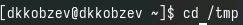

## Cодержимое каталога /tmp

- Выводим на экран содержимое каталога /tmp. Для  этого используем команду ls с различными опциями 

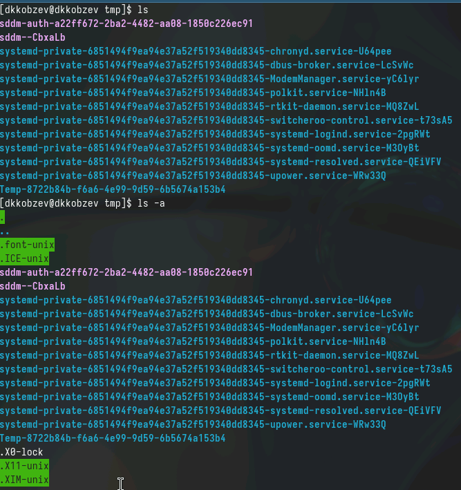

## Cодержимое каталога /tmp

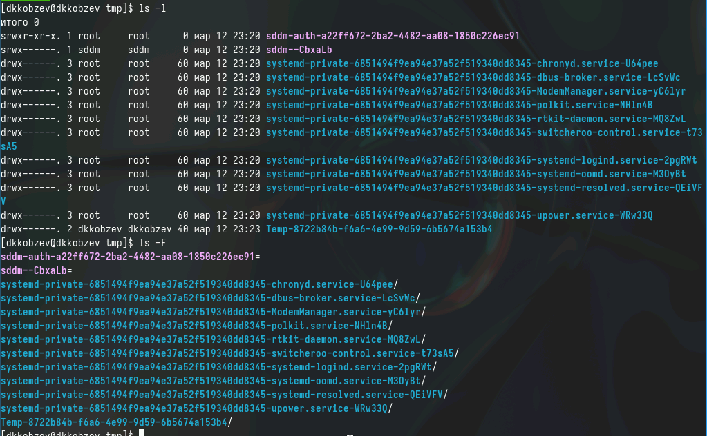

## Содержимое каталога /var/spool

- Определяем, есть ли в каталоге /var/spool подкаталог с именем cron

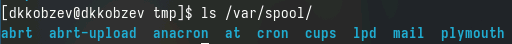

## Содержимое домашнего каталога

- Переходим в наш домашний каталог и выводим а экран его содержимое. Определяем, кто является владельцем файлов и подкаталогов

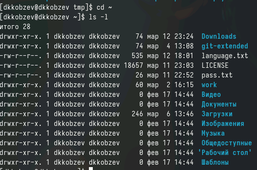

## Создание каталога newdir

- В домашнем каталоге создаем новый каталог с именем newdir

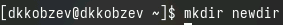

## Создание каталога morefun

- В каталоге ~/newdir создаем новый каталог с именем morefun

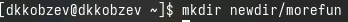

## Создание и удаление новых каталогов

- В домашнем каталоге создаем одной командой три новых каталога с именами
letters, memos, misk. Затем удаляем эти каталоги одной командой

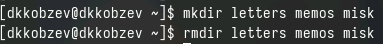

## Удаление каталога /newdir

- Пробуем удалить ранее созданный каталог ~/newdir командой rm

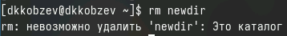

## Удаление каталога /morefun

- Удаляем каталог ~/newdir/morefun из домашнего каталога

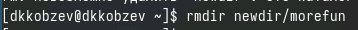

## Опция -R

- С помощью команды man определяем, какую опцию команды ls нужно использовать для просмотра содержимое не только указанного каталога, но и подкаталогов,
входящих в него

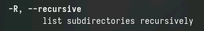

## Опции -l  и -t

- С помощью команды man определяем набор опций команды ls, позволяющий отсортировать по времени последнего изменения выводимый список содержимого каталога
с развёрнутым описанием файлов

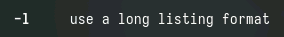

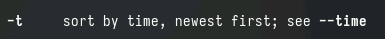

## Описание команды cd

- Используем команду man для просмотра описания команды cd

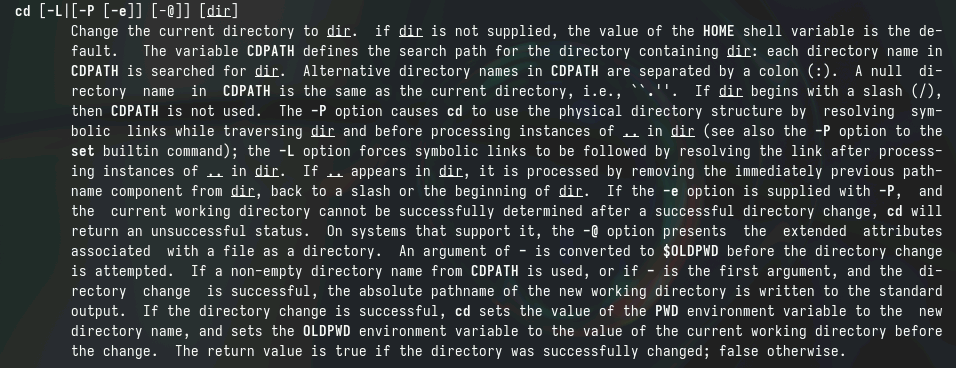

## Описание команды pwd

- Используем команду man для просмотра описания команды pwd

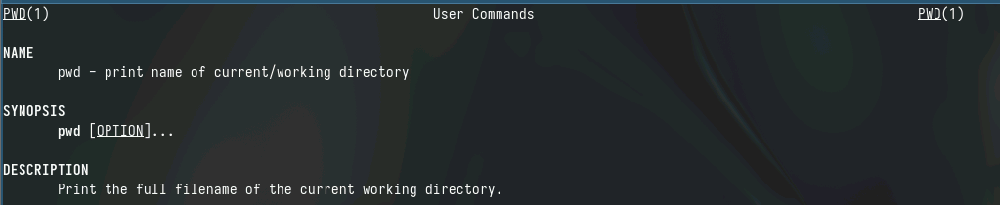

## Описание команды mkdir

- Используем команду man для просмотра описания команды mkdir

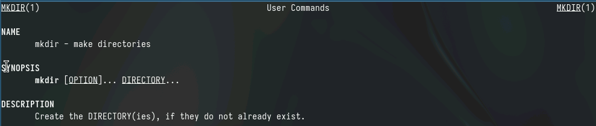

## Описание команды rmdir

- Используем команду man для просмотра описания команды rmdir

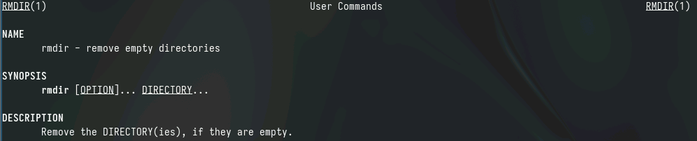

## Описание команды rm

- Используем команду man для просмотра описания команды rm

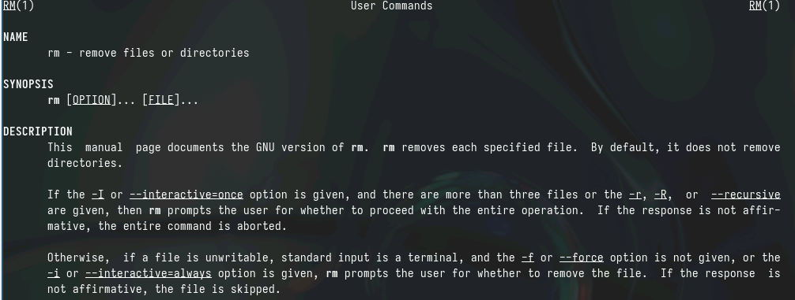

## Модификация и исполнение команд из буфера команд

- Используя информацию, полученную при помощи команды history, выполняем модификацию и исполнение нескольких команд из буфера команд

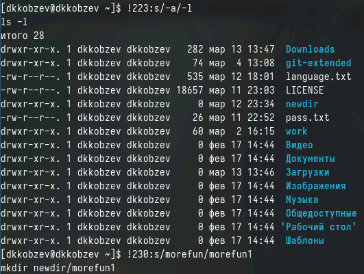
