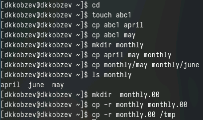
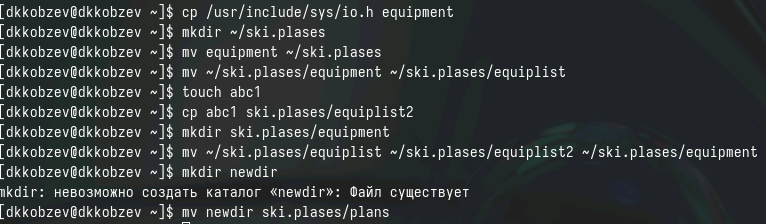
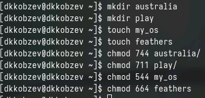
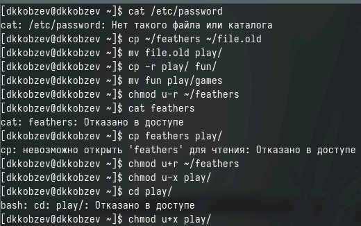

---
## Front matter
lang: ru-RU
title: Лабораторная работа №7
subtitle: Архитектура компьютера и операционные системы
author:
  - Кобзев Д. К.
institute:
  - Российский университет дружбы народов, Москва, Россия
date: 30 августа 2005

## i18n babel
babel-lang: russian
babel-otherlangs: english

## Formatting pdf
toc: false
toc-title: Содержание
slide_level: 2
aspectratio: 169
section-titles: true
theme: metropolis
header-includes:
 - \metroset{progressbar=frametitle,sectionpage=progressbar,numbering=fraction}
 - '\makeatletter'
 - '\beamer@ignorenonframefalse'
 - '\makeatother'

## Fonts
mainfont: PT Serif
romanfont: PT Serif
sansfont: PT Sans
monofont: PT Mono
mainfontoptions: Ligatures=TeX
romanfontoptions: Ligatures=TeX
sansfontoptions: Ligatures=TeX,Scale=MatchLowercase
monofontoptions: Scale=MatchLowercase,Scale=0.9
---

# Информация

## Докладчик

:::::::::::::: {.columns align=center}
::: {.column width="70%"}

  * Кобзев Дмитрий Константинович
  * студент
  * прикладная информатика
  * Российский университет дружбы народов
  * [1132231936@rudn.ru](mailto:1132231936@rudn.ru)

:::
::: {.column width="30%"}

:::
::::::::::::::

# Вводная часть

## Цель работы

Ознакомление с файловой системой Linux, её структурой, именами и содержанием
каталогов. Приобретение практических навыков по применению команд для работы
с файлами и каталогами, по управлению процессами (и работами), по проверке использования диска и обслуживанию файловой системы.

# Выполнение лабораторной работы

## Примеры, приведённые в первой части описания лабораторной работы

- Выполняем все примеры, приведённые в первой части описания лабораторной работы

## Выполение перечисленных действий

- Копируем файл /usr/include/sys/io.h в домашний каталог и называем его equipment.  
- В домашнем каталоге создаем директорию ~/ski.plases.  
- Перемещаем файл equipment в каталог ~/ski.plases.  
- Переименовываем файл ~/ski.plases/equipment в ~/ski.plases/equiplist.  
- Создаем в домашнем каталоге файл abc1 и копируем его в каталог ~/ski.plases, называем его equiplist2.  
- Создаем каталог с именем equipment в каталоге ~/ski.plases.  
- Перемещаем файлы ~/ski.plases/equiplist и equiplist2 в каталог ~/ski.plases/equipment.  
- Создаем и перемещаем каталог ~/newdir в каталог ~/ski.plases и называем его plans

## Выполение перечисленных действий

## Присваивание файлам прав доступа

- Определяем опции команды chmod, необходимые для того, чтобы присвоить файлам права доступа, считая, что в начале таких прав нет

## Выполнение упражнений

- Просматриваем содержимое файла /etc/password.  
- Копируем файл ~/feathers в файл ~/file.old.  
- Перемещаем файл ~/file.old в каталог ~/play.  
- Копируем каталог ~/play в каталог ~/fun.  
- Перемещаем каталог ~/fun в каталог ~/play и назовите его games.  
- Лишаем владельца файла ~/feathers права на чтение.  
- Пытаемся просмотреть файл ~/feathers командой cat?  
- Пытаемся скопировать файл ~/feathers?  
- Даем владельцу файла ~/feathers право на чтение.  
- Лишаем владельца каталога ~/play права на выполнение.  
- Переходим в каталог ~/play. Что произошло?  
- Даем владельцу каталога ~/play право на выполнение

## Выполнение упражнений

## Характеризация команд mount, fsck, mkfs, kill 

- Команда mount используется для подмонтирования файловых систем (mount /dir)  
- Команда fsck используется для проверки и восстановления целостности файловых систем (fsck /home)  
- Команда mkfs используется для создания новой файловой системы (mkfs /dev/hda1)  
- Команда kill для завершения процессов (kill 1)  

# Выводы

Я был ознакомлен с файловой системой Linux, её структурой, именами и содержанием
каталогов. Мною были приобретены практические навыков по применению команд для работы
с файлами и каталогами, по управлению процессами (и работами), по проверке использования диска и обслуживанию файловой системы.
